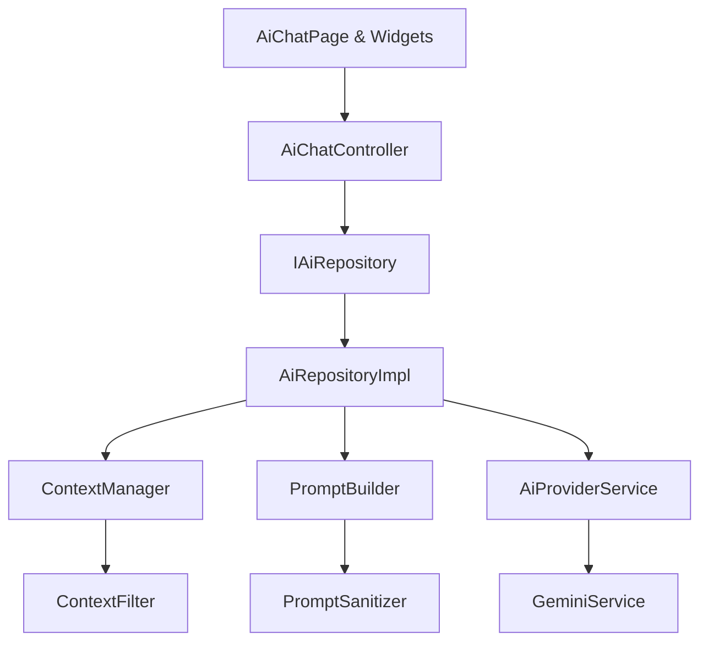

# AI Assistant Module Documentation

## Architecture Overview
The AI Assistant module follows strict Clean Architecture and SOLID principles. It operates as a fully isolated, self-contained feature module that can be injected into any Flutter application without modifying existing business logic. The architecture is designed to be provider-agnostic, meaning the underlying LLM (e.g., Gemini, OpenAI, Claude) can be swapped out seamlessly without affecting the Domain or Presentation layers.

## Folder Responsibilities
- **`config/`**: Centralized configuration constants (e.g., timeouts, model names) mapped through `AiConfig`.
- **`context/`**: The Context Engine. Responsible for dynamically fetching, scrubbing (filtering PII), and formatting raw data into a provider-agnostic `AiContext`.
- **`controllers/`**: State management layer. Contains `AiChatController` which bridges the UI and the Repository using immutable states.
- **`core/`**: Core utilities, sealed result types (`AiResult`), and domain-level custom exceptions (`AiError`, `AiException`).
- **`domain/`**: Enterprise business rules. Contains abstract repository contracts (`IAiRepository`) and provider-agnostic requests (`AiRequest`).
- **`models/`**: Strongly typed data classes (`AiMessage`, `AiResponse`, `AiContext`) used across the module.
- **`presentation/`**: The UI layer. Contains state classes (`AiChatState`) and pages (`AiChatPage`).
- **`prompts/`**: The Prompt Engine. Responsible for safely constructing, combining, and sanitizing system and user prompts to prevent injection attacks.
- **`repository/`**: The coordination layer. Implements `IAiRepository` to wire the Context Engine, Prompt Engine, and Network Provider.
- **`services/`**: The network layer. Contains abstract `AiProviderService` and concrete implementations like `GeminiService`.
- **`utils/`**: Helper classes like `AiLogger` for structured debug logging.
- **`widgets/`**: Reusable UI components (bubbles, input bars, typing indicators).

## Data Flow
1. **User Input**: The user types a message in `AiInputBar`.
2. **Controller**: `AiChatController` immediately updates `AiChatState` to `loading` and appends the user's message to the UI.
3. **Repository Coordination**: `AiChatController` calls `AiRepositoryImpl.askAi()`.
4. **Context Engine**: `AiRepositoryImpl` requests an `AiContext` from `ContextManager`. The data is filtered for PII and formatted.
5. **Prompt Engine**: `AiRepositoryImpl` passes the context and user input to `PromptBuilder` to generate safe, injection-free prompt maps.
6. **Provider Service**: The repository invokes `AiProviderService.generateResponse()`.
7. **Network**: `GeminiService` builds the JSON payload, injects API keys via headers, and makes the HTTP request.
8. **Mapping**: Raw JSON is parsed by `AiResponseMapper` into an `AiResponse`.
9. **State Update**: The repository wraps the response in an `AiResult.success` and returns it to the controller.
10. **UI Refresh**: The controller updates the state with the AI's message, stopping the loading indicator.

## Class Responsibilities
- **`AiModule`**: The primary dependency injection container. Wires all components together.
- **`AiChatController`**: Manages the `ValueNotifier<AiChatState>` and orchestrates the conversation lifecycle.
- **`AiRepositoryImpl`**: Bridges Domain requests to the concrete Engines and Network services.
- **`ContextManager`**: Caches and builds context blocks.
- **`ContextFilter`**: Recursively scrubs passwords, tokens, and PII from raw data.
- **`PromptSanitizer`**: Truncates massive inputs (DoS protection) and strips HTML/Markdown injection.
- **`GeminiService`**: Pure network logic for the Google Gemini REST API.

## Dependency Graph


## Extension Guide
- **Adding new Widgets**: Create them in `widgets/` and rely exclusively on properties or callbacks. Do not pass the `AiChatController` deep into widget trees.
- **Adding new Context Data**: Pass raw `Map<String, dynamic>` maps to `rawDocuments` in the controller's `sendMessage`. The `ContextFilter` will automatically protect it.

## Maintenance Guide
- **Updating the Gemini API**: Modify `_buildPayload` in `GeminiService.dart`. If the response schema changes, update `AiResponseMapper.fromGeminiRaw`.
- **Modifying State**: Always use `copyWith` on `AiChatState`. Never mutate the lists directly.
- **Security Audits**: Keep `ContextFilter._excludedKeys` updated with any new sensitive database field names.

## Future AI Provider Guide
To swap Gemini out for OpenAI or Claude:
1. Create a new service class in `services/`:
   ```dart
   class OpenAiService implements AiProviderService {
     // Implement generateResponse and generateResponseStream
   }
   ```
2. Create a specific mapper: `AiResponseMapper.fromOpenAiRaw()`.
3. Update `AiModule.dart` to inject `OpenAiService` into `AiRepositoryImpl` instead of `GeminiService`.
4. No other files (UI, Controllers, Repositories, Domain) require modification.
